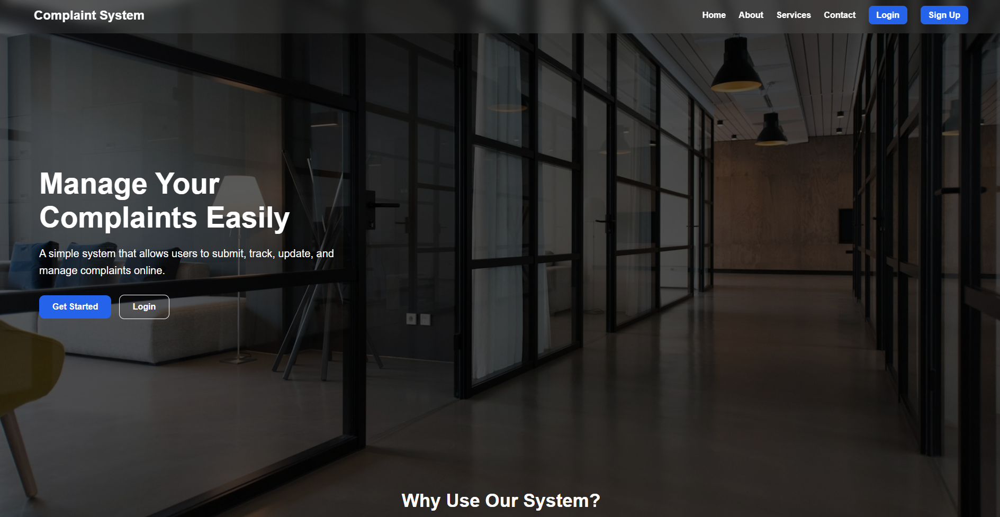
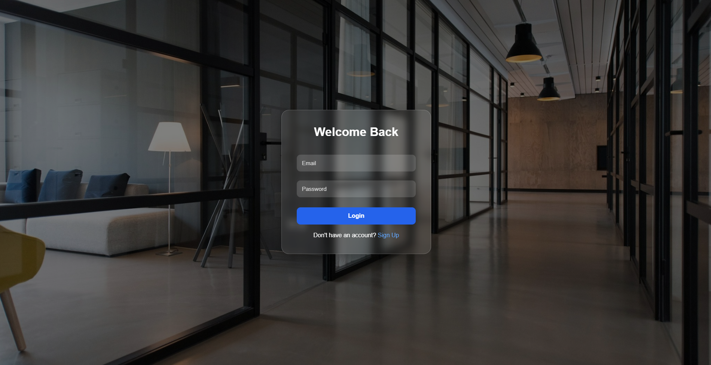
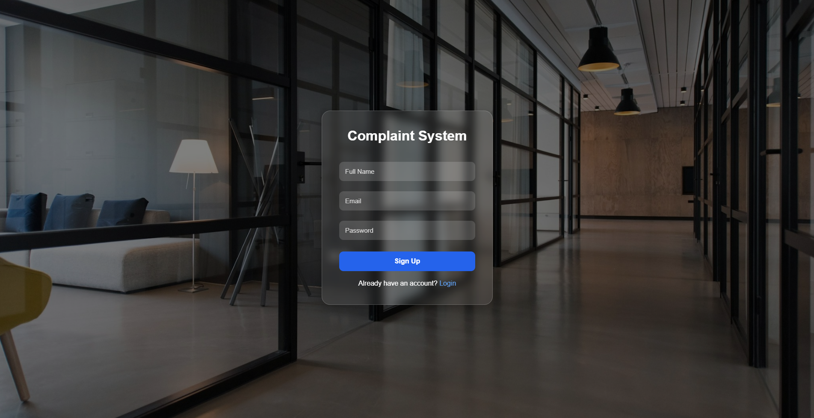
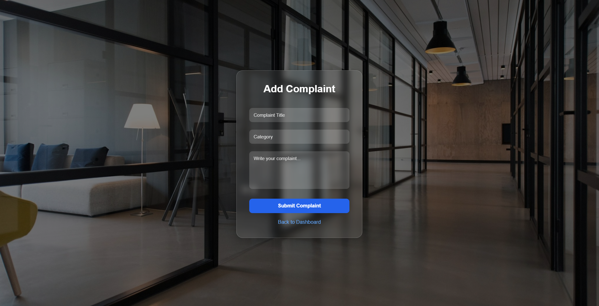
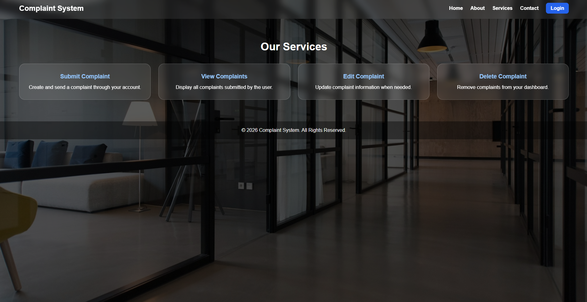
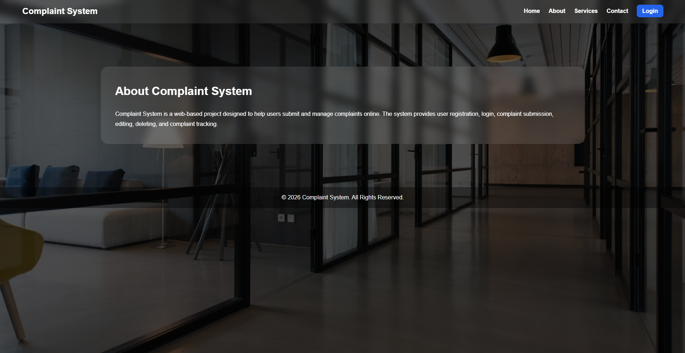
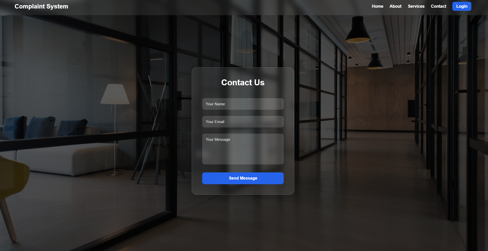
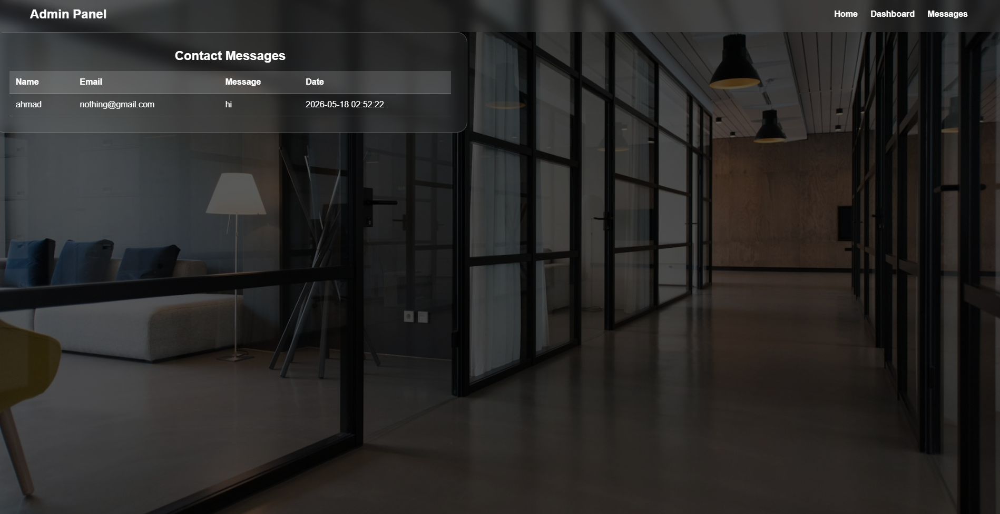

# 📢 Complaint Management System

A web-based Complaint Management System developed using PHP, MySQL, HTML, CSS, and JavaScript. The system allows users to register, log in, submit, edit, delete, and manage complaints, while providing an admin panel to manage contact messages.

---

## ✨ Features

- 🔐 User Authentication
- 👤 User Registration
- 🔑 User Login & Logout
- ➕ Submit Complaints
- ✏️ Edit Complaints
- 🗑 Delete Complaints
- 📋 Complaint Dashboard
- 📬 Contact Form
- 👨‍💼 Admin Panel
- 💬 View Contact Messages
- 📱 Responsive Design

---

## 🛠 Technologies Used

- PHP
- MySQL
- HTML5
- CSS3
- JavaScript
- SQL

---

# 📸 Screenshots

## 🏠 Home Page



---

## 🔐 Login



---

## 👤 Sign Up



---

## ➕ Submit Complaint



---

## 📋 Services



---

## ℹ️ About Page



---

## 📩 Contact Form



---

## 👨‍💼 Admin Messages



---

# 🚀 How to Run

1. Clone or download the repository.
2. Copy the project folder into the **htdocs** directory.
3. Import the **complaint_system.sql** database.
4. Start **Apache** and **MySQL** using XAMPP.
5. Open the project in your browser.

---

# 📁 Project Structure

```text
Complaint-Management-System
│
├── screenshots/
├── about.php
├── add.php
├── admin_messages.php
├── contact.php
├── dashboard.php
├── db.php
├── delete.php
├── edit.php
├── index.php
├── login.php
├── logout.php
├── signup.php
├── services.php
├── script.js
├── style.css
└── complaint_system.sql
```

---

# 👨‍💻 Author

**Abdalwahab Al-Qatawneh**

GitHub:
https://github.com/Abedulwahab
